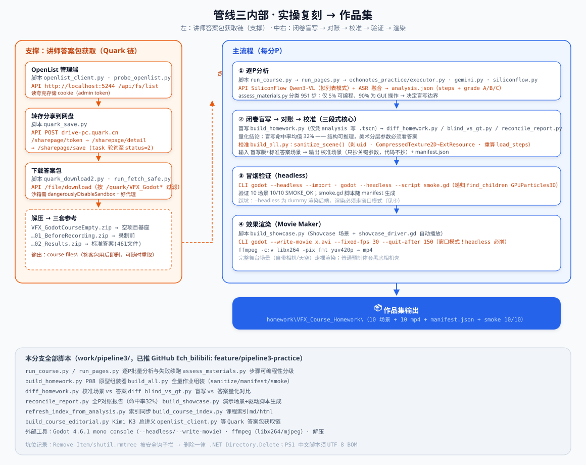
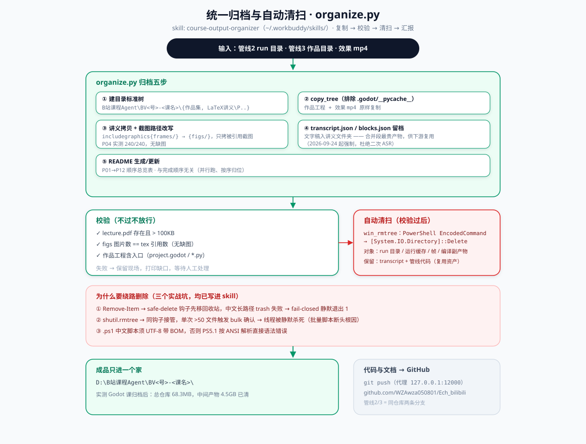

# Ech_practice · 管线三：实操教程 → 复刻作品集

> 输入实操教程视频，输出**可运行的复刻工程** + 效果预览 mp4 + 实验报告。

拾音笺视频观看 agent 三管线之三（姊妹仓库：[Ech_bilibili](https://github.com/WZAwza050801/Ech_bilibili) 读书笔记 · [Ech_lecture](https://github.com/WZAwza050801/Ech_lecture) LaTeX 讲义）。


## 环境准备（3 步）

### 1. 系统要求

| 项目 | 版本要求 | 用途 | 缺失后果 |
|---|---|---|---|
| Python | >= 3.10 | 全部脚本 | 无法运行 |
| ffmpeg | 任意近期版本 | 抽帧 / mp4 转码 | 抽帧与成片失败 |
| Godot | 4.2+（可选） | 复刻工程冒烟 + Movie Maker 渲染 mp4 | 只能出代码与报告，不能验证运行 |

### 2. 安装依赖

```bash
python -m venv .venv
# Linux/macOS: source .venv/bin/activate
# Windows:     .venv\Scripts\activate

pip install -r requirements.txt          # 核心依赖
pip install -r requirements-asr.txt      # 可选：本地语音转写（建议独立虚拟环境）
```

> 依赖刻意做薄：管线主体只用标准库 + 一两个轻量包；`faster-whisper` 会拖入
> ctranslate2 等重依赖，因此单独放 `requirements-asr.txt`，装到独立 venv 后用
> `ECHONOTES_ASR_PYTHON` 指过去，避免与主线环境互相污染。

### 3. 自检（**跑管线前先跑它**）

```bash
python scripts/check_env.py
```

逐项打印 `[ OK ] / [WARN] / [FAIL]`，缺什么、去哪装、装完怎么验证一次说清；
有必需项缺失时退出码为 1。`--ci` 只校验 Python 与 pip 依赖（给 CI 用）。

### 密钥

复制 `.env.example` 为 `.env` 后填写（`.env` 已被 `.gitignore` 拦截，永不入库）。
每个 Key 用在哪、为什么选这个模型、去哪申请，见 [docs/API_SETUP.md](docs/API_SETUP.md)。
Ech_practice 的必需 Key：**SILICONFLOW_API_KEY**。

### 常见故障速查

| 症状 | 原因 | 解决 |
|---|---|---|
| godot --headless --write-movie 崩溃 | headless 走 dummy 渲染器，Movie Maker 不支持 | 必须用窗口模式渲染，这是已知硬限制 |
| 抽帧结果为空 | ffmpeg 缺失或视频源受限 | 先 `ffmpeg -version`，再确认视频/音频源可直取 |
| 视觉分析 401/超时 | Key 未设置或额度用尽 | 重设 SILICONFLOW_API_KEY |
| 渲染出的 mp4 是黑屏 | 场景缺少相机/灯光，或特效未被驱动 | 用 build_showcase.py 自动补相机与灯光并驱动播放 |

### 跑起来

```bash
python run_course.py <课程链接>   # 或 python echonotes_practice/ 下对应脚本
```

## 方法论：闭卷盲写 → 对账 → 校准（三段式）



1. **盲写（闭卷）**：agent 只看视频分析结果写场景/代码，不看任何答案；
2. **对账**：与讲师标准答案工程做量化 diff（节点数/纹理引用/参数命中）；
3. **校准**：只对齐关键参数——美术分层参数无法从视频恢复（实测盲写命中率均值 32%），
   代码逻辑则不抄，用官方空项目基座。

## 验证链路

```
组装 → godot --headless --import → godot --headless --script smoke.gd → SMOKE_OK
渲染 → build_showcase.py（相机+灯+自动播放驱动）→ godot --write-movie（Movie Maker）
     → ffmpeg libx264 → mp4 预览
```

注意：`--headless` 是 dummy 渲染后端，`--write-movie` 必须用窗口模式离屏渲染。

## 验收案例

- 《Python 基础实战100例 · 自制简易计算器》（BV1fy4y1K7Mi，A级复刻 + 实验报告）
- 《Godot 游戏特效｜入门至进阶实战课》全 12 分P：10 个特效场景 + 10 段效果 mp4，
  冒烟测试 10/10（含 AoE / 火花 / 投射物 / 枪口 / 撞击 / 闪电）

## 脚本清单（本仓库根目录）

| 脚本 | 职责 |
|---|---|
| run_course.py / run_pages.py | 逐P批量分析与失败续跑 |
| echonotes_practice/ | 执行器核心（Gemini/SiliconFlow 视觉 · A/B/C 分级 · 合同校验） |
| assess_materials.py | 步骤可编程性分级 |
| build_homework.py / build_all.py | 盲写组装器 + 全量作业组装（场景消毒/manifest） |
| diff_homework.py / blind_vs_gt.py / reconcile_report.py | 盲写 vs 标准答案量化对账 |
| build_showcase.py | 演示场景生成 + Movie Maker 渲染链 |
| openlist_client.py / quark_save.py / quark_download2.py | 讲师答案包网盘获取链 |

## 统一归档

成品归档至 `D:\B站课程Agent\BV<号>-<课名>\{ 作品集\, LaTeX讲义\, README.md }`，
中间产物校验通过后自动清扫（详见 [归档清扫流程图](docs/flow-archive.svg)）。



## API 配置

本仓库用到哪些 Key、为什么选这些模型、在哪申请、怎么自检——见 [docs/API_SETUP.md](docs/API_SETUP.md)。密钥永不入库。